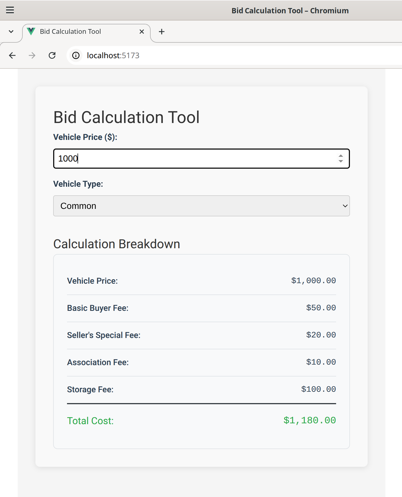

[](https://github.com/esavard-homelab/BidCalculationTool/actions/workflows/ci.yml)

# The Bid Calculation Tool

A full-stack web application for calculating the total price of vehicles (Common or Luxury) at car auctions, including
various fees and charges with dynamic fee structure support.

## Project Overview

This application calculates the total cost of purchasing a vehicle at auction by applying different fees based on
vehicle type and price. The system supports **dynamic fee structures** that can be easily extended without frontend
changes:

- **Basic buyer fee**: 10% of vehicle price (with min/max limits based on type)
- **Seller's special fee**: 2% (Common) or 4% (Luxury) of vehicle price  
- **Association fee**: Tiered based on price ranges ($5-$20)
- **Storage fee**: Fixed $100

### Example Calculation
For a **Common vehicle** priced at **$1,000**:
- Vehicle Price: $1,000 + Basic buyer fee: $50 + Special fee: $20 + Association fee: $10 + Storage fee: $100 = 
**Total: $1,180**

## Technology Stack
- **Backend**: .NET Core 8 (C#) with RESTful API
- **Frontend**: Vue.js 3 with Vite and TypeScript
- **Infrastructure**: Docker & Docker Compose
- **Development**: Hot reload for both frontend and backend
- **CI/CD**: GitHub Actions with automated testing
- **Quality**: Extended test coverage on both frontend and backend (near 100% for critical paths)

## Screenshot


## Getting Started

### Prerequisites
- **Docker** + **Docker Compose plugin** (version >= 20.10)
- **Node.js** ≥ 22.x (for build scripts)

### Quick Start
```bash
npm install && npm run init && npm run dev
```

**Access:**
- Frontend: http://localhost:5173 (development) 
- Backend API: http://localhost:5000/swagger

<!-- TODO: For production deployment, update access URLs to HTTPS:
     - Frontend: https://yourdomain.com (served by Nginx with SSL)
     - Backend API: https://api.yourdomain.com (or behind reverse proxy)
     - Configure proper domain names and SSL certificates
-->

### Available Commands
```bash
npm run init      # Initialize and start development environment  
npm run dev       # Start development containers with hot reload
npm run prod      # Build and start production containers
npm run test:ci   # Run all tests (backend + frontend)
npm run docs      # Generate architecture diagrams
npm run stop      # Stop all containers OR ctrl+C in terminal
```

## Project Structure
```
BidCalculationTool/
├── backend/                                   # .NET Core 8 backend
│   ├── src/
│   │   ├── BidCalculationTool.Api/            # API layer (controllers, endpoints, Program.cs)
│   │   ├── BidCalculationTool.Application/    # Application layer (use cases, application services)
│   │   ├── BidCalculationTool.Domain/         # Domain layer (entities, aggregates, interfaces)
│   │   └── BidCalculationTool.Infrastructure/ # Infrastructure layer (implementations, data access)
│   ├── test/                                 # Backend tests
│   ├── BidCalculationTool.sln                 # Solution file
│   ├── backend.http                           # HTTP requests for testing
│   ├── Dockerfile                             # Production image
│   └── Dockerfile.dev                         # Development with hot reload
├── frontend/                                  # Vue.js 3 application
│   ├── src/
│   │   ├── core/                              # Reusable elements (services, utils, etc.)
│   │   ├── modules/                           # Feature modules
│   │   │   └── BidCalculator/
│   │   │       ├── components/                # Feature-specific components (CalculationBreakdown)
│   │   │       ├── dto/                       # DTOs/types for API communication
│   │   │       ├── services/                  # UI logic (BidCalculationService)
│   │   │       ├── validators/                # UI fields value validators (VehiclePriceValidator)
│   │   │       └── views/                     # Main calculator view
│   │   ├── test/                              # Unit tests
│   │   └── assets/                            # Images, styles
│   ├── public/                                # Static assets
│   ├── package.json                           # Dependencies and scripts
│   ├── Dockerfile                             # Production image (Nginx)
│   └── Dockerfile.dev                         # Development with hot reload
├── docs/                                      # Documentation
│   ├── adr/                                   # Architectural Decision Records
│   ├── requirements/                          # Challenge description
│   └── c4/                                    # C4 architecture diagrams
├── scripts/                                   # Automation scripts
├── docker-compose.parent.yml                  # Base Docker configuration
├── docker-compose.dev.yml                     # Development overrides
├── docker-compose.prod.yml                    # Production overrides
└── package.json                               # Root project scripts
```

## Documentation

### Architecture & Decisions
- [Requirements](./docs/requirements/coding-challenge.md) - Original coding challenge
- [ADR-001](./docs/adr/001-project-structure-and-technology-stack.md) - Project Structure and Technology Stack
- [ADR-002](./docs/adr/002-docker-and-docker-compose-usage.md) - Docker and Docker Compose Usage
- [ADR-003](./docs/adr/003-use-rest-over-graphql.md) - Choosing REST over GraphQL
- [ADR-004](./docs/adr/004-production-configuration-management.md) - Production Configuration and Environment Management
- [ADR-005](./docs/adr/005-observability-and-monitoring-strategy.md) - Observability and Monitoring Strategy
- [ADR-006](./docs/adr/006-frontend-resilience-and-internationalization.md) - Frontend Resilience and i18n Improvements

**Note**: The ADRs 004, 005, and 006 are still in draft status and represent some changes that will be needed to make
the application production-ready, as described in the [coding challenge](./docs/requirements/coding-challenge.md).

### C4 Architecture Diagrams
- [Container Diagram](./docs/c4/diagrams/container-diagram.svg) - System overview
- [Sequence Diagram](./docs/c4/diagrams/sequence-diagram.svg) - User flow

## AI Usage Disclaimer
AI (GitHub Copilot plugin) was used as technical support for architectural validation, documentation drafts,
configuration debugging, and boilerplate generation. All code was critically reviewed, adapted, and tested.

## Work Environment
This project was developed in a Linux environment (Ubuntu 22.04 LTS) using Rider IDE, with Docker and Docker Compose for
containerization. The code is designed to be platform-agnostic, ensuring compatibility across different operating system.

---
*This project demonstrates full-stack development capabilities with modern tools and enterprise-grade architecture
patterns, prioritizing code quality, maintainability, and scalability.*
